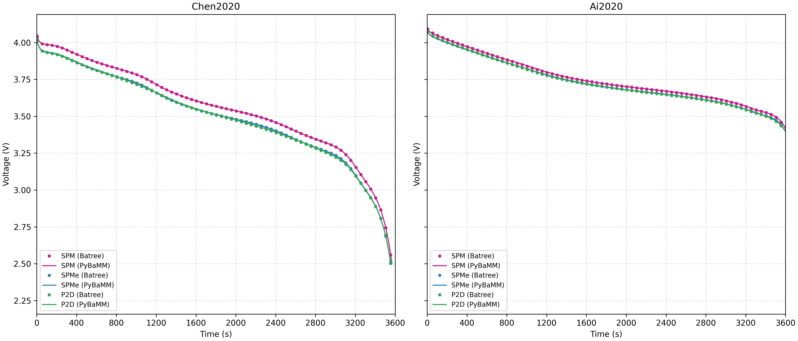

# Batree: An MFEM-based SPM, SPMe and P2D solver

_Nuno Nobre, Karthikeyan Chockalingam, Daniel Ward and Olha Yaman, STFC Hartree Centre_

[](https://doi.org/10.5281/zenodo.19338017)
[](https://github.com/stfc/Batree/actions/workflows/style.yml)
[](https://github.com/stfc/Batree/actions/workflows/tests.yml)

###

Compile with `make batree`.

Sample runs:
```
mpirun -np 1 ./batree -m SPM
mpirun -np 3 ./batree -m SPMe -c Enertech
mpirun -np 4 ./batree -m P2D
```

Under active development. Use `-m` or `--method` to select from the three
electrochemical models (`SPM`, `SPMe` or `P2D`) and `-c` or `--cell`
to select from the two available cells (`LGM50` for the LG INR 21700 M50
cylindrical cell[^1] or `Enertech` for the Enertech LCO-G SPB655060 pouch
cell[^2]). At the moment, the program will only perform a single 1C discharge
cycle until the time specified with `-tf` or `--t-final` (3600s by default).
Run with `-h` or `--help` for all available options. No explicit time
integration methods are supported at this time.

Details on the formulation, including parametrisation, scaling and literature
references can be found under [docs/](docs). Refer to [validation/](validation)
for a simple script comparing the results of our implementation against PyBAMM,
from which you can obtain the following figure:



[^1]: Chen et al., (2020). *Development of Experimental Techniques for Parameterization of Multi-scale Lithium-ion Battery Models*. Journal of The Electrochemical Society, 167(8). https://iopscience.iop.org/article/10.1149/1945-7111/ab9050

[^2]: Ai et al., (2020). *Electrochemical Thermal-Mechanical Modelling of Stress Inhomogeneity in Lithium-Ion Pouch Cells*. Journal of The Electrochemical Society, 167(1). https://iopscience.iop.org/article/10.1149/2.0122001JES